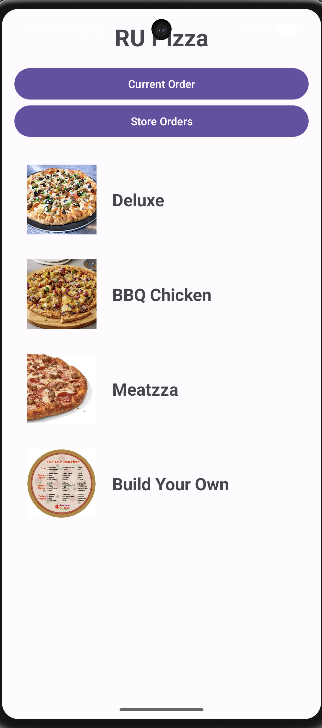
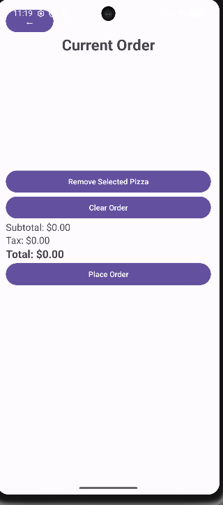
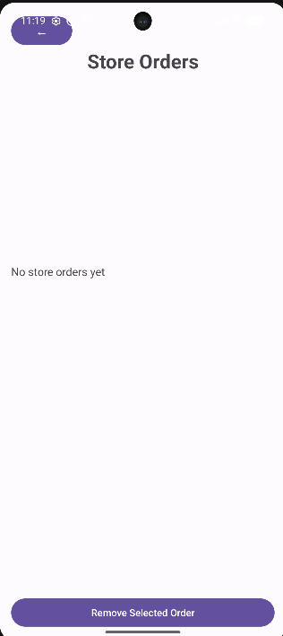
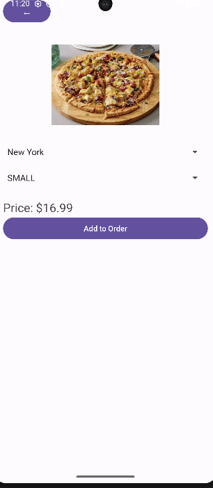

# Android Pizza Ordering App

An Android pizza ordering application built with Java and Android Studio. The application allows users to create custom pizzas, order specialty pizzas, manage current orders, and view store-wide orders through an interactive mobile interface.

## Features

* Deluxe, BBQ Chicken, and Meatzza specialty pizzas
* Build Your Own pizza customization
* Dynamic pricing based on pizza size and toppings
* Current order management
* Store order tracking
* Real-time subtotal, tax, and total calculations
* Interactive Android user interface

## Technologies Used

* Java
* Android Studio
* Android SDK
* XML Layouts
* RecyclerView
* Object-Oriented Programming (OOP)

## Screenshots

### Home Screen

### Pizza Builder

### Current Order

### Store Orders

## Authors

Lucas Barrales and Shivang Patel

